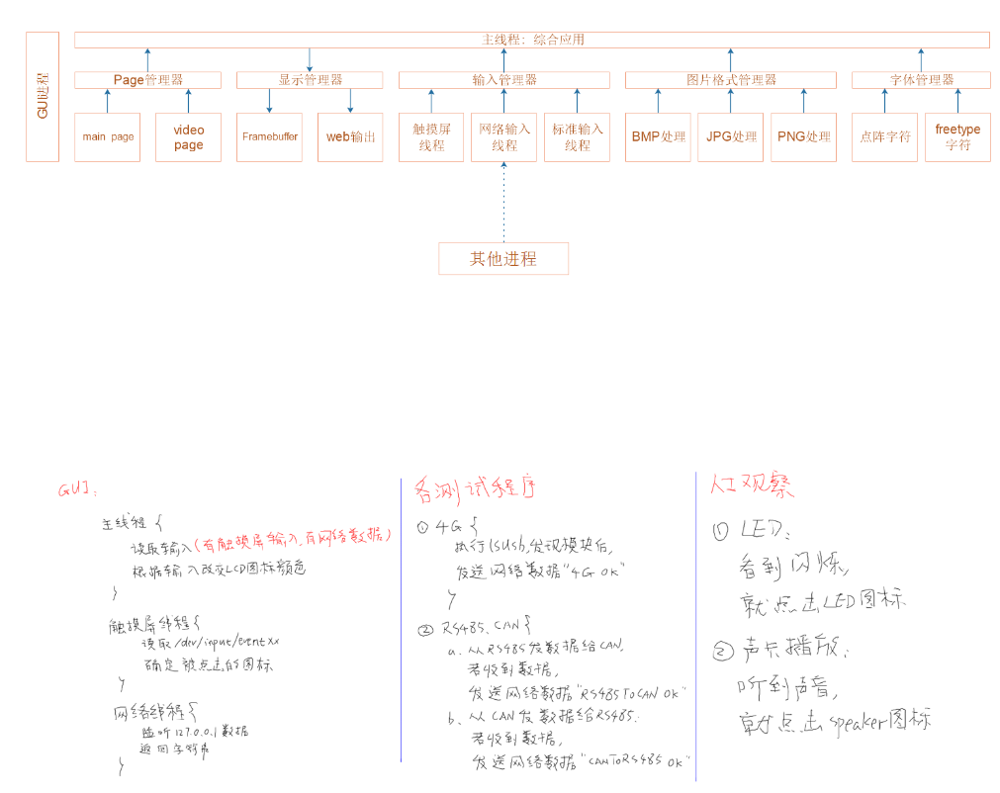

## imx6ull_board-level_test_tool

### 系统架构图


### 显示管理器

* 包含：**disp_manager.c/h、framebuffer.c/h**模块

  1. **disp_manager.c/h**：显示管理器
  2. **framebuffer.c/h**：底层显示模块

* **disp_manager.c/h**：数据显示部分**在**显示管理器**的管理之下，**支持多种方式**进行数据显示，**显示管理器**可以**向主线程提供数据显示的通用API**，也可以**向底层显示设备提供通用的结构体**，以**方便底层显示设备可以注册进显示管理器**供**主线程使用**，**显示管理器**向主线程提供的通用**API如下：

  ```C++
  //provide with model of disp_manager.c to display device
  int putPixel(int x, int y, unsigned int dwColor);  //绘制单个像素点
  void dispDevRegister(PDispDev_S pDispDev);         //注册某个底层显示设备到显示管理器
  
  //provide with model of disp_manager.c to disp_test.c/user
  void dispSystemRegister(void);                     //注册所有底层显示设备
  int selectDefaultDispDev(char* pName);             //选择一个显示设备
int defaultDispDevInit(void);                      //初始化已经选择的显示设备
  void dispDefaultDev(int x, int y, unsigned char c);//在buffer中显示数据
int flushDispRegion(PDispRegion_S pDispRegion, PDispBuffer_S pDispBuffer); //把buffer中的数据刷到显示设备的内存中
  PDispBuffer_S getDispBuffer(void);//获取buffer
  ```
  
  显示管理器用`DispDev`结构体描述底层显示设备，用`DispBuffer`结构体描述显示`buffer`，用结构体`DispRegion`描述`buffer`刷新到硬件显示内存的哪个区域，只有当显示`buffer`刷新到硬件显存之后，数据才会真正的显示；底层显示设备使用显示管理器提供的`int putPixel(int x, int y, unsigned int dwColor)`函数构造自己的数据显示函数，从而在提供给显示管理器，底层显示设备使用`dispDevRegister`函数把自己的`DispDev`结构体注册进显示管理器，显示管理器通过链表的形式把所有显示设备连接起来，需要使用的时候就在链表中查询
  
  ```C++
  typedef struct DispBuffer
  {
      int xRes;
  	int yRes;
  	int bpp;
  	char* pBuffer;
  }DispBuffer_S, *PDispBuffer_S;
  
  typedef struct DispDev
  {
      char* pName;
  	int   (*dispDevInit)(void); 
  	int   (*dispDevExit)(void); 
  	int   (*getDispBuffer)(PDispBuffer_S pDispBuffer);
  	void  (*dispDev)(int x, int y, unsigned char c);
  	int   (*flushDispRegion)(PDispRegion_S pDispRegion, PDispBuffer_S pDispBuffer);
  	struct DispDev* pNext;
  }DispDev_S, *PDispDev_S;
  ```

### 输入管理器

* 包含：**input_manager.c/h、netinput.c/h、touchscreen.c/h**模块

  1. **input_manager.c/h**：输入管理器
  2. **netinput.c/h**：网络输入模块
  3. **touchscreen.c/h**：**LCD**输入模块

* **数据输入部分**在**输入管理器**的管理之下，支持多种方式输入数据，输入管理器主要**向主线程提供通用的API函数**，屏蔽掉底层硬件复杂的操作逻辑，同时对底层硬件进行抽象管理，用链表连接每个硬件设备，对于需要使用的硬件设备，只需要**注册进输入管理器**即可

* 输入管理器提供给主线程的通用API：

  ```C++
  //provide with model of input_manager.c to input device
  void inputDevRegister(PInputDevice_S ptInputDev);     //注册底层硬件输入设备到输入管理器
  
  //provide with model of input_manager.c to input_test.c/user
void inputSystemRegister(void);                       //注册所有底层输入设备
  int  inputDeviceInit(void);                           //初始化所有输入设备
int userGetInputEventData(PInputEvent_S pInputEvent); //获取输入数据
  ```
  
  输入管理器抽象出`InputDevice`结构体用来描述每个硬件输入设备
  
  ```C++
  typedef struct InputDevice
  {
      char* name;             //设备名
  	int   (*inputDevInit)(void); //设备初始化函数
  	int   (*inputDevExit)(void); //设备卸载函数
	int   (*getInputEvent)(PInputEvent_S pInputEvent); //获取设备的输入数据
  	struct InputDevice* pNext; //指向注册进输入管理器的下一个设备InputDevice结构体
}InputDevice_S, * PInputDevice_S;
  ```
  
  其中`InputEvent`结构体用来描述**硬件设备输入的一次完整数据**
  
  ```C++
  typedef struct InputEvent
  {
      int type;              //数据类型，触摸输入 or 网络输入
      int x;                 //触摸屏X坐标
  	int y;                 //触摸屏Y坐标
  	int pressure;          //压力
	char str[1024];        //网络输入的字符串
  	struct timeval time;   //系统后的时间
  }InputEvent_S, * PInputEvent_S;
  ```
  
  **底层硬件输入设备**通过输入管理器提供的函数`inputDevRegister`把自己**注册进输入管理器**
  
* **touchscreen.c/h**：通过**tslib**库实现数据的读取，然后放进**InputEvent**，而**netinput.c/h**通过UDP协议获取数据，然后放进**InputEvent**结构体

* 数据读取的过程：

  1. **inputDeviceInit**函数会为**每个底层输入设备**创建一个**数据读取线程**，当有数据输入的时候，线程会把数据读取回来，然后放入环形buffer，然后通过**pthread_cond_signal**唤醒**userGetInputEventData**函数从环形**buf**读取数据
  2. 当环形buf没有数据的时候，**userGetInputEventData**会阻塞在**pthread_cond_wait**函数处

### 字体管理器

* 交叉编译**zlib-1.2.11**：

  1. 下载

  ` wget http://www.zlib.net/fossils/zlib-1.2.11.tar.gz `

  2. 解压

  `tar -zxvf  zlib-1.2.11.tar.gz `

  3. 指定工具链

  `export CC=arm-linux-gnueabihf-gcc` 

  4. 编译

  `cd /zlib-1.2.11`

  ` ./configure --prefix=./tmp `

  `make`

  `make install`

  5. 把交叉编译生成的头文件放入工具链

  `cd zlib-1.2.11/tmp`

  `cp include/* /home/yhd_wsl2/100ask_imx6ull-sdk/ToolChain/gcc-linaro-6.2.1-2016.11-x86_64_arm-linux-gnueabihf/bin/../arm-linux-gnueabihf/libc/usr/include`

  `cp -d lib/*so* /home/yhd_wsl2/100ask_imx6ull-sdk/ToolChain/gcc-linaro-6.2.1-2016.11-x86_64_arm-linux-gnueabihf/bin/../arm-linux-gnueabihf/libc/usr/lib/`

* **交叉编译**`libpng1.6.37`

  1. 解压

  `tar xJf libpng-1.6.37.tar.xz`

  2. 编译

  `./configure --host=arm-linux-gnueabihf --prefix=$PWD/tmp`

  `make`

  `make install`

  3. 把交叉编译生成的头文件放入工具链

  `libpng-1.6.37/tmp`

  `cp include/* -rf /home/yhd_wsl2/100ask_imx6ull-sdk/ToolChain/gcc-linaro-6.2.1-2016.11-x86_64_arm-linux-gnueabihf/bin/../arm-linux-gnueabihf/libc/usr/include`

  `cp lib/* -rfd /home/yhd_wsl2/100ask_imx6ull-sdk/ToolChain/gcc-linaro-6.2.1-2016.11-x86_64_arm-linux-gnueabihf/bin/../arm-linux-gnueabihf/libc/usr/lib/`

* **交叉编译**`bzip2-1.0.6`

  1. 下载

  `wget https://sourceforge.net/projects/bzip2/files/bzip2-1.0.6.tar.gz`

  2. 解压

  `tar -zxvf bzip2-1.0.6.tar.gz`

  3. 编译

  `cd bzip2-1.0.6 ` 

  `vim Makefile`

  

  `vim Makefile-libbz2_so`

  

`make && make install`

4. 把交叉编译生成的头文件放入工具链

`cd bzip2-1.0.6/tmp`

`cp include/* -rf /home/yhd_wsl2/100ask_imx6ull-sdk/ToolChain/gcc-linaro-6.2.1-2016.11-x86_64_arm-linux-gnueabihf/bin/../arm-linux-gnueabihf/libc/usr/include`

`cp lib/* -rfd /home/yhd_wsl2/100ask_imx6ull-sdk/ToolChain/gcc-linaro-6.2.1-2016.11-x86_64_arm-linux-gnueabihf/bin/../arm-linux-gnueabihf/libc/usr/lib/`

`cd bzip2-1.0.6`

`ln -s libbz2.so.1.0.6 libbz2.so`

`cp libbz2.so* -rfd /home/yhd_wsl2/100ask_imx6ull-sdk/ToolChain/gcc-linaro-6.2.1-2016.11-x86_64_arm-linux-gnueabihf/bin/../arm-linux-gnueabihf/libc/usr/lib/`

* **交叉编译**`freetype-2.10.2`

  1. 解压

  `tar xJf freetype-2.10.2`

  2. 编译

  `./configure --host=arm-linux-gnueabihf --prefix=$PWD/tmp`

  `make`

  `make install`

  3. 把交叉编译生成的头文件放入工具链

  `cd freetype-2.10.2/tmp`

  `cp include/* -rf /home/yhd_wsl2/100ask_imx6ull-sdk/ToolChain/gcc-linaro-6.2.1-2016.11-x86_64_arm-linux-gnueabihf/bin/../arm-linux-gnueabihf/libc/usr/include`

  `cp lib/* -rfd /home/yhd_wsl2/100ask_imx6ull-sdk/ToolChain/gcc-linaro-6.2.1-2016.11-x86_64_arm-linux-gnueabihf/bin/../arm-linux-gnueabihf/libc/usr/lib/`

* 包含：**font_manager.c/h、freetype.c/h**等模块

  1. **font_manager.c/h**：字体管理器
  2. **freetype.c/h**：底层字体处理引擎

* **字体管理器**抽象出`FontLib`结构体用来描述不同的**字体管理工具**，通过该结构体可以返回**显示字符的点阵位图**

```C++
typedef struct FontLib
{
    char * pName;
	int (*fontInit)(char * pFontFileName);
	int (*setFontSize)(int fontSize);
	int (*getFontBitMap)(unsigned int fontCode, PFontBitMap_S pFontBitMap);
	int (*getStrBoxRegionCar)(char * pStr, PDispRegionCartesian_S pDispRegionCartesian);
	struct FontLib *pNext;
}FontLib_S, * PFontLib_S;
```

其中`FontBitMap`结构体用来**描述一个字符的位图**

```C++
typedef struct FontBitMap
{
    DispRegion_S region;
	int curOriginX;
	int curOriginY;
	int nextOriginX;
	int nextOriginY;
	unsigned char *pBuffer;
}FontBitMap_S, * PFontBitMap_S;
```

**字体管理器**也起着呈上启下的作用，向用户提供简单字体处理函数：

```C++
//provide with model of font_manager.c to font lib
void fontlibRegister(PFontLib_S pFontLib);        //注册底层单个字库处理工具，freetype，点阵字库等                  

//provide with model of font_manager.c to font_test.c/user
void fontsLibSystemRegister(void);               //把支持的所有字库处理工具注册到管理器
int selectAndInitFontLib(char * pFontLibName, char * pFontFileName);//选择并且初始化字库，打开字体文件
int setFontSize(int fontSize);                  //设置字体大小
int getFontBitMap(unsigned int fontCode, PFontBitMap_S pFontBitMap);  //获得字符的位图
int getStrBoxRegionCar(char *pStr, PDispRegionCartesian_S pDispRegionCartesian); //获取字符串的外框
```

向**底层字库管理工具**提供注册函数

```C++
void fontlibRegister(PFontLib_S pFontLib)
```

同时在**显示管理器**中实现位图显示函数，把字符的位图信息写到**显示buffer**中

```C++
void drawFontBitMap(PFontBitMap_S pFontBitMap, unsigned int dwColor);
```

最后通过显示管理器提供的函数`flushDispRegion`把数据刷到显存中

```C++
int flushDispRegion(PDispRegion_S pDispRegion, PDispBuffer_S pDispBuffer)
```

### UI系统

* 包含：**ui.h、ui.button.c**
* 通过抽象一个`UiButton`结构体来描述一个**LCD**显示器上的虚拟按钮

```C++
typedef struct UiButton
{
    char * pName;                             //按钮名字
	int status;                               //按钮状态
	int fontSize;                             //按钮名字的字体
	DispRegion_S region;                      //按钮的显示区域
	PDrawButtonFunc pDrawButton;              //绘制按钮的函数
	PPressedButtonFunc pPressedButton;        //按钮按下调用的函数
}UiButton_S, *PUiButton_S;
```

用户通过调用`initButton`函数初始化一个按钮，其中`pDrawButton`和`pPressedButton`可以由用户提供，也可以使用默认的函数

### 页面管理器

* 包含**page_manager.c/h、mainpage.c/h**模块
  1. **page_manager.c/h**：页面管理器
  2. **mainpage.c/h**：底层页面模块

* 页面管理器通过抽象结构体**PageAction**来描述一个底层的页面模块

  ```C++
  typedef struct PageAction
  {
      char * pName;                    //底层页面的名字
  	void (*run)(void * pParams);     //底层页面对应的响应函数
  	struct PageAction * pNext;       //所有页面通过链表进行存储      
  }PageAction_S, * PPageAction_S;
  ```

  页面管理器向底层页面模块，比如**mainpage.c/h**，提供注册函数**pageRegister**，底层页面便可以把实现的**PageAction**结构体注册到页面管理器中，页面管理器可以向用户提供简单页面处理接口：

  ```C++
  //provide with model of page_manager.c to page_action
  void pageRegister(PPageAction_S pPageAction);  //注册某一个底层页面
  
  //provide with model of page_manager.c to user/page_test.c
  PPageAction_S selectPage(char * pName);   //选择需要使用的底层页面
  void pageSystemRegister(void);            //注册所有底层页面
  ```

### 业务系统

* 初始化显示系统、输入系统、字体系统、页面系统，调用主页面，在主页面中读取配置文件，根据配置文件生成按钮界面，然后等待事件缓冲区有数据便可以读取事件，根据事件找到对应的输入设备(按钮、网络输入)，然后执行相应的响应函数


------------------------

### 输出调试管理器

* 包含**degug_manager.c/h、netprint.c、stdout.c**模块

  1. **degug_manager.c/h**：调试管理器
  2. **netprint.c**：底层网络调试模块
  3. **stdout.c**：标准输出调试模块

* **调试管理器**通过抽象**DebugOpr**结构体来描述底层调试模块

  ```C++
  typedef struct DebugOpr {
  	char *name;                //调试模块名字
  	int isCanUse;              //模块使能
  	int (*DebugInit)(void);   /* 调试模块的初始化函数 */
  	int (*DebugExit)(void);   /* 退出函数 */
  	int (*DebugPrint)(char *strData);  /* 输出函数 */
  	struct DebugOpr *ptNext;  //调试管理器通过链表管理底层调试模块
  }T_DebugOpr, *PT_DebugOpr;
  ```

  1. 页面管理器向底层调试模块提供**RegisterDebugOpr**函数，底层模块可以通过该函数把具体填充的**DebugOpr**结构体注册到调试管理器中

  2. 页面管理器向用户提供以下API

     ```C++
     void ShowDebugOpr(void);//打印系统支持调试模块
     PT_DebugOpr GetDebugOpr(char *pcName);//获得调试模块的结构体
     int SetDbgLevel(char *strBuf);//设置调试信息打印等级
     int SetDbgChanel(char *strBuf);//选择打印模块
     int DebugInit(void);//注册调试管理器中的调试模块
     int DebugPrint(const char *pcFormat, ...);//通过调试模块输出调试信息
     int InitDebugChanel(void); //调用底层调试模块的初始化函数
     ```

  3. 调试信息只有超过**g_iDbgLevelLimit**这个级别，才能被输出

* **底层调试模块**的具体实现原理：
  
  1. **stdout.c**标准输出调试模块通过**printf**函数实现
  2. **netprint.c**底层网络调试模块基于UDP协议实现，该模块会初始化为一个UDP服务器，并且创建发送线程、接受线程、环形缓冲区。接受线程可以接受客户端的命令，实现设置打印级别，使能/失能打印模块。当上层进行数据打印的时候，**netprint.c**中的打印函数会把数据存入环形缓冲区，并且唤醒发送线程，发送线程从环形缓冲区取出数据然后便可以发送给客户端进行显示